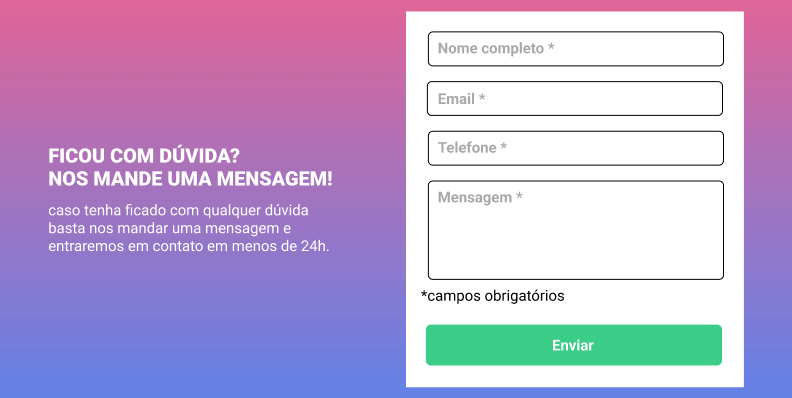
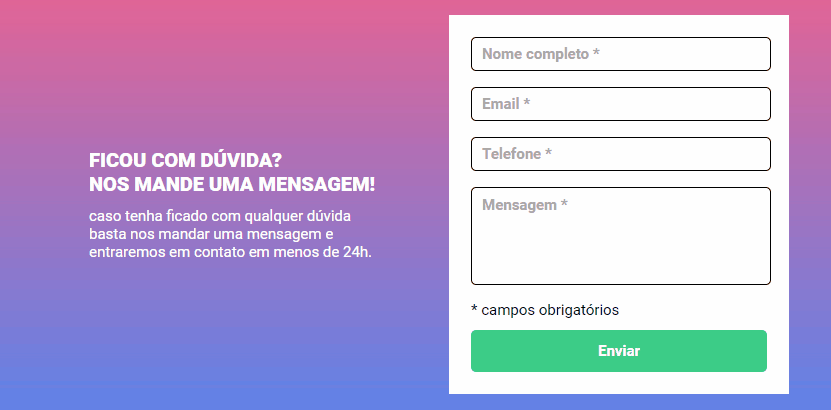

<h1 align="center">Projeto Formulário</h1>

Desenvolver métricas de validação de um formulário

 

 <a href="#sobre">Sobre</a> •
 <a href="#objetivos">Objetivos</a> •
 <a href="#uso">Uso</a> •
 <a href="#status">Status</a> • 
 <a href="#passos">Passos</a> • 
 <a href="#tecnologias">Tecnologias</a> •  
 <a href="#autor">Autor</a>

<section id="sobre">
    <h2>Sobre o projeto</h2>
    
O projeto consiste na criação de uma página web, na qual possui um texto e um formulário, seguindo as métricas e orientações dispostas em um arquivo do Figma.

    
Abaixo segue uma imagem do projeto:

    
</section>

<section id="objetivos">
    <h2>Objetivos</h2>
    
Os objetivos do projeto consistem:

    <ul>
        <li>Colocar em prática os conceitos de estruturação dos elementos HTML;</li>
        <li>Utilizar a estruturação dos elementos em conjunto com a estilização no CSS, a fim de gerar o resultado visual proposto pelo projeto;</li>
        <li>Construir a lógica no JavaScript para o formulário, validando, de forma básica, os dados inseridos no mesmo, seguindo as orientações abaixo:
            <ul>
                <li>Ao preencher um campo, o mesmo deve ficar com a borda na cor verde;</li>
                <li>Ao clicar no botão "Enviar", caso algum campo esteja vazio, este deverá ficar com a borda na cor vermelha, bem como uma mensagem deve ser exibida ao usuário, informando-o que aquele campo é obrigatório o seu preenchimento;</li>
                <li>O envio do formulário só será permitido quando todos os campos estiverem preenchidos.</li>
            </ul>
        </li>
        <li>Aplicar o conceito de responsividade, adaptando o projeto a todos os dispositivos.</li>
    </ul>
</section>

<section id="uso">
    <h2>Uso</h2>
    
Abaixo segue o projeto em uso, com um exemplo fictício:

    
    
O efeito de cores, bem como do texto abaixo de cada campo, auxiliam o usuário no entendimento do que é ou não aceito ao clicar no botão "Enviar".
     
    É uma verificação básica, que leva em conta apenas se o campo possui ou não preenchimento.
    

</section>

<section id="status">
    <h2>Status</h2>
    
O Projeto Formulário encontra-se finalizado.

</section>

<section id="passos">
    <h2>Passos para rodar o projeto</h2>
    
Antes de começar, tenha instalado na sua máquina o navegador de sua preferência.
     
    No navegador, acesse o <a href="https://hugo-moreira91.github.io/projeto-formulario/">projeto</a> via Github Pages.
    

</section>

<section id="tecnologias">
    <h2>Tecnologias/Linguagens</h2>
    
As seguintes tecnologias/linguagens foram utilizadas:

    <ul>
        <li><a href="https://developer.mozilla.org/en-US/docs/Web/HTML">HTML5</a></li>
        <li><a href="https://developer.mozilla.org/en-US/docs/Web/CSS">CSS3</a></li>
        <li><a href="https://developer.mozilla.org/en-US/docs/Web/JavaScript">JavaScript</a></li>
    </ul>
</section>

<section id="autor">
    <h2>Autor</h2>
    <a href="https://github.com/Hugo-Moreira91">Hugo Moreira 🚀</a>
      
    
Feito com 💓 e dedicação! ✍🏼 Entre em contato:

    <ul>
        <li><a href="https://www.linkedin.com/in/hugo-c%C3%A9sar-santos-moreira-a10823248/">LinkedIn</a></li>
        <li>E-mail: hugo.cesar91@gmail.com</li>
    </ul>
</section>